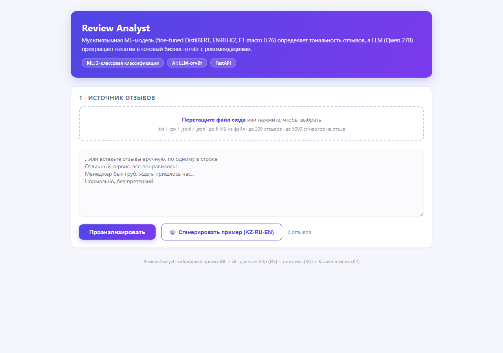
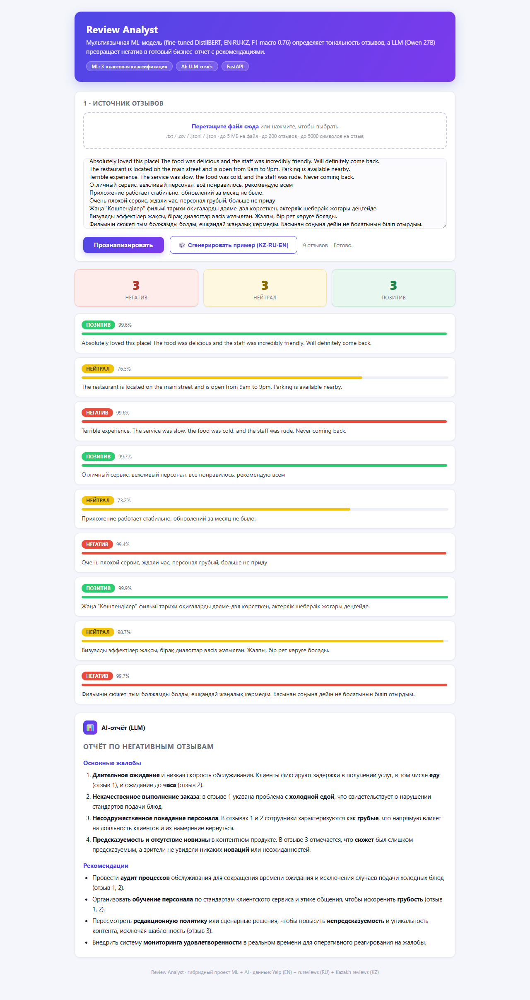

# Review Analyst — гибридный ML + LLM анализ отзывов

Курсовой проект по Data Science. Приложение классифицирует отзывы клиентов
(негатив / нейтрал / позитив) на **трёх языках (EN / RU / KZ)** с помощью
fine-tuned мультиязычной трансформер-модели и генерирует бизнес-отчёт на
естественном языке с помощью LLM.

| Интерфейс | Результат: ML-классификация + LLM-отчёт |
|---|---|
|  |  |

## Что делает

1. **ML-классификатор** — fine-tuned **DistilBERT multilingual**
   (`lxyuan/distilbert-base-multilingual-cased-sentiments-student`, 135M)
   обучен на 30 859 отзывах: Yelp (EN, 10k), rureviews + MultiLingualSentiment
   (RU, 20k), Kazakh entertainment reviews (KZ, ~1k). Для каждого отзыва
   выдаёт класс и вероятности по всем трём классам.
2. **LLM-отчёт** — локальная модель (Qwen 27B, OpenAI-совместимый API) читает
   негативные отзывы и пишет структурированный отчёт на русском: основные
   жалобы + рекомендации, со ссылками на номера отзывов.
3. **Веб-интерфейс** — FastAPI + HTML/JS. Можно вставить отзывы вручную,
   перетащить файл (`.txt`, `.csv`, `.jsonl`, `.json`) или нажать
   «Сгенерировать пример» — LLM сгенерирует 12 отзывов на KZ/RU/EN.

## Структура проекта

```
review_analyst/
├── app.py                  # FastAPI-приложение + встроенный UI
├── requirements.txt
├── .env                    # LLM_API_BASE / LLM_API_KEY / LLM_MODEL (не коммитить)
├── data/
│   ├── raw/yelp_reviews.csv        # EN: 30k отзывов, 3 класса
│   ├── raw/rureviews.csv           # RU: 90k отзывов (одежда/товары), 3 класса
│   └── sample_reviews.csv          # пример: 9 отзывов (3 EN + 3 RU + 3 KZ)
├── notebooks/
│   └── analysis.ipynb        # EDA + сравнение классических моделей + мультиязычная модель + LLM-отчёт
├── model/
│   ├── multilingual/         # fine-tuned DistilBERT (model + tokenizer + metrics.json)
│   ├── best_pipeline.pkl     # классический пайплайн (LinearSVC, для сравнения)
│   └── metrics.pkl           # таблица метрик классических моделей
├── screenshots/
│   ├── ui.png                # скриншот интерфейса
│   └── demo.png              # скриншот результата
├── presentation/
│   └── presentation.pptx     # 5-минутная презентация
└── scripts/
    ├── prepare_multilingual.py   # сборка мультиязычного датасета (train/test JSONL)
    ├── finetune_multilingual.py  # fine-tuning DistilBERT (5 эпох, fp16) + per-language метрики
    ├── build_notebook.py         # генерация и исполнение ноутбука
    ├── build_presentation.py     # генерация презентации
    ├── compare_models.py         # сравнение классических моделей
    ├── take_screenshot.py        # скриншоты через headless Edge
    ├── gen_sample_file.py        # генерация примера через LLM
    └── test_api.py               # end-to-end тест API
```

## Метрики

### Мультиязычная модель (рабочая, в приложении)

Fine-tuning: 5 эпох, fp16, batch 16×2 (grad accum), lr 2e-5, max_length 128.
Test set: 4 250 отзывов (EN 2 000 / RU 2 000 / KZ 250). RU test — только
общедоменные отзывы (рестораны/организации/товары), т.к. это реальный сценарий
приложения, а не узкий домен rureviews (одежда).

| Язык | Acc | F1 macro | ROC AUC |
|---|---|---|---|
| EN | 0.682 | 0.685 | 0.851 |
| **RU** | **0.814** | **0.814** | **0.934** |
| KZ | 1.000* | 1.000* | 1.000* |
| **Overall** | **0.763** | **0.764** | **0.906** |

\* KZ: только 1 250 открытых отзывов (развлекательный домен), test — 250.
Метрики KZ завышены малой выборкой и узким доменом — см. «Ограничения».

### Классические модели (EN, для сравнения — в ноутбуке)

| Модель | Acc | F1 (macro) | ROC AUC |
|---|---|---|---|
| **LinearSVC (биграммы, calibrated)** | 0.7453 | **0.7440** | **0.8938** |
| Logistic Regression (биграммы) | 0.7343 | 0.7345 | 0.8910 |
| XGBoost (биграммы, GPU) | 0.7050 | 0.7056 | 0.8720 |
| Naive Bayes (униграммы, baseline) | 0.6578 | 0.6608 | 0.8426 |

**Вывод:** на разреженных TF-IDF-признаках линейные модели обгоняют
градиентный бустинг — XGBoost теряет точность из-за переобучения на
высокоразмерных бинарных признаках. TF-IDF-модели не понимают русский и
казахский (40.1% accuracy на не-EN — случайный уровень), поэтому рабочая
модель приложения — трансформер.

## Запуск

```bash
# 1. Зависимости (torch лучше ставить с CUDA-индексом, см. ниже)
pip install -r requirements.txt
# для GPU: pip install torch --index-url https://download.pytorch.org/whl/cu126

# 2. Настроить LLM (уже в .env, не коммитить)
#    LLM_API_BASE=https://...
#    LLM_API_KEY=...
#    LLM_MODEL=...

# 3. Запустить сервер
python -m uvicorn app:app --port 8000
```

Открыть **http://127.0.0.1:8000**, вставить отзывы, перетащить
`data/sample_reviews.csv` или нажать «Сгенерировать пример (KZ·RU·EN)».

### Переобучение модели (опционально)

```bash
python scripts/prepare_multilingual.py    # ~1 мин: сборка train/test JSONL
python scripts/finetune_multilingual.py   # ~10 мин на RTX 3050 Ti (4GB, fp16)
```

## Ограничения (честно)

Модель — 135M-трансформер, обученный на ~31k отзывах. Она надёжна на
однозначных отзывах (вероятность 0.95–1.00), но систематически ошибается на
нюансах. Проверенные вручную провалы:

- **Отрицание/контекст:** «Персонал оперативно поменял *грязные* салфетки»
  (похвала за проактивность) → негатив 0.69. Модель цепляется за слово
  «грязные», не считывая позитивный фрейм.
- **Слабый позитив → нейтрал:** «Prices were competitive and the checkout
  lines moved quickly» → нейтрал 0.83. Даже «great / super fast» остаётся
  нейтралом (0.54).
- **Смешанные/ироничные отзывы:** «Всё понравилось, но больше сюда не приду»
  → позитив 0.83 (решающий маркер «не приду» проигрывает «всё понравилось»).
- **RU food-домен:** у базовой sentiment-модели инвертирована еда:
  «суп был вкусным» → негатив, «Кухня грязная, суп невкусный» → позитив.
  Fine-tuning поднял RU в целом (F1 0.75 → 0.81), но не убрал этот bias.
- **KZ — только развлекательный домен:** открытого казахского датасета
  бизнес-отзывов нет (большие датасеты gated). Модель идеально классифицирует
  KZ-отзывы о кино/музыке (домен обучения), но KZ-отзывы о ресторанах/магазинах
  классифицирует неверно. Поэтому генератор примеров выдаёт KZ-отзывы именно
  о развлечениях.
- **KZ-метрики завышены** малой выборкой (test 250) — это ограничение данных,
  а не модели.

Другие ограничения:

- Лимиты: до 200 отзывов, до 5000 символов на отзыв, до 5 МБ на файл.
- LLM — thinking-модель: каждый запрос обязан передавать
  `extra_body={"chat_template_kwargs": {"enable_thinking": False}}` и
  `max_tokens >= 1600`, иначе `content` приходит пустым.
- LLM-генератор примеров не всегда держит точный сплит 4/4/4 по языкам
  (27B-модель иногда «плывёт» в русский) — это ограничение LLM, не ML.
